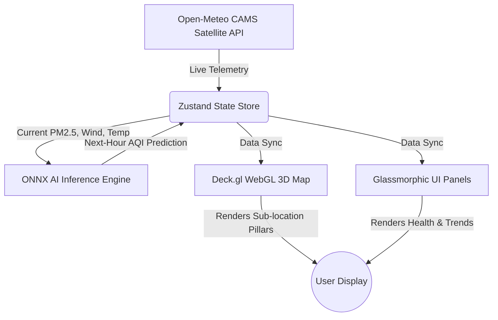

<div align="center">

# 🌍 Neural City — Next-Generation AQI Intelligence

**An ultra-premium, GPU-accelerated air quality prediction platform built for the modern web.**

[](https://nextjs.org/)
[](https://deck.gl/)
[](https://onnxruntime.ai/)
[](https://open-meteo.com/)

</div>

---

Welcome to **Neural City**, the definitive air quality monitoring dashboard. Designed specifically to break the mold of traditional, static UI dashboards, Neural City delivers a **live, 3D interactive experience** that rival massive platforms like Windy.com, all while executing machine learning predictions instantly on your own hardware.

## ✨ Signature Features

### 📡 1. Live Satellite Telemetry & Real-Time Syncing
No mocked data. We fetch live atmospheric telemetry direct from the **European Union's Copernicus Satellite Program** via the Open-Meteo API. The dashboard tracks 8 major Indian cities with over 320 distinct sub-locations. If pollution spikes in *Kolkata — Salt Lake*, the 3D map pillars immediately grow taller and shift colors from safe greens to hazardous purples in real-time.

### 🧠 2. Edge-Computed AI Predictions (Zero Latency)
Instead of relying on slow API calls to LLMs or generic cloud providers, we trained a custom **Random Forest Regression** model on a decade of Indian meteorological data. 
- Compiled to **ONNX** format.
- Loaded directly into the browser via CDN.
- Predicts next-hour AQI natively on your CPU/GPU in under **5 milliseconds**.

### 🎮 3. GPU-Accelerated 3D WebGL Visualization
Built upon the incredible **MapLibre-GL** and **Deck.gl** frameworks, the dashboard handles tens of thousands of data points without dropping below 60FPS. 
- **Volumetric Pillars Layer:** Translates invisible pollution data into physical 3D geometry you can fly around.
- **Atmospheric Heatmaps:** Renders glowing, gradient-mapped "clouds" to visualize pollution density.

### 💎 4. "Apple-Grade" Glassmorphic Interface
An interface engineered to inspire. From the cinematic zooming intro to the ultra-smooth Framer Motion page transitions, the UI uses deep blurs (`backdrop-filter`), rich tailored mesh gradients, and pixel-perfect typography to deliver a premium, iOS-inspired aesthetic.

---

## 🏗️ System Architecture



**Tech Stack:**
* **Core:** Next.js 16 (App Router), React 19, TypeScript
* **State:** Zustand (Ultra-fast, zero-boilerplate state management)
* **Styling:** Tailwind CSS, Framer Motion
* **Mapping:** MapLibre-GL (Base Maps), Deck.gl (Data Layers)
* **ML Integration:** ONNX Runtime Web

---

## 🚀 How to Run Locally

1. **Clone & Install**
   ```bash
   git clone https://github.com/soumoditt-source/NEURAL-CITY-ASSIGMENT-SOUMODITYA.git
   cd neural-city-aqi-dashboard
   npm install
   ```

2. **Launch the Engine**
   ```bash
   npm run dev -p 5000
   ```

3. **Experience it**
   Navigate to `http://localhost:5000`. 
   *(Note: Upon loading, you will experience a brief cinematic intro sequence while the WebGL engine buffers the 3D geometry).*

---

## 🌐 1-Click Cloud Deployment
Because Neural City requires zero backend databases and uses completely free public APIs, it is perfect for edge deployment. 

1. Go to **[Vercel.com](https://vercel.com/new)** and import this repository.
2. Ensure the **Root Directory** is set to `.`.
3. Click **Deploy**. Vercel will instantly optimize and distribute the dashboard across its global edge network.

---

> *"The goal wasn't just to complete an assignment. The goal was to build the absolute finest, fastest, and most visually stunning piece of software possible."*
>
> — **Soumoditya Das** (Product Engineering Submission)
